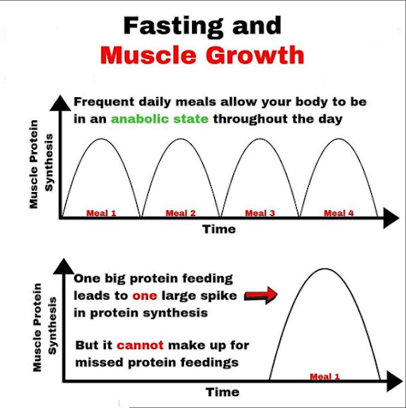

## The first step

This article is the first installment of my "Optimal Aesthetics" series, which showcases the most efficient methods and techniques to getting the most aesthetic physique as quick as possible.

The first concept to understand to getting "massive" or the gaining the most muscle possible- MPS(muscle protein synthesis). The first thing anyone wants to know(amateur physique competitor or even the average Joe) is how frequent to workout,how intense to workout,etc. The reality is however ,more than your training, your nutrition and lifestyle matter much more to reach your goals. So the variable of MPS is one of the most significant variables involved in fitness, but is also one of the least emphasized in fitness as well(especially in social media).

> Many modern day "influencers" and fitness "experts" claim that fasting is an essential
> part of fitness.They are right that fasting is great for people interested in only loosing weight, and individuals
> who have already reached a sizeable muscle mass. However, for most people trying to feel full and keep as much
> muscle as possible on a cut, it's simply a bad idea.

## What is MPS

What is MPS? Muscle protein synthesis is a naturally occurring process in which protein is produced to repair muscle damage caused by exercise.It is the opposite force of muscle protein breakdown (MPB) in which protein is lost as a result of exercise. Why does MPS matter? MPS is essentially the primary factor for stimulating muscle growth and primary driver of the anabolic state The anabolic state has no specific definition, but generally refers to the circumstance in which the rate of muscle protein synthesis exceeds the rate of muscle protein breakdown.Thus the optimization of MPS is one of the keys factors to reaching the best physique possible.

## Optimal MPS

Optimal MPS has been found to be reached when eating meal frequency is around 4–5 meals a day(can differ based on individuals). Your MPS peaks 1.5–2 hours after eating a meal rich in protein and returns to baseline after 3–5 hours. Eating 4–5 meals a day allows MPS to be at it's peak more frequently, leaving you in an anabolic state for almost the entirety of your day.This translates to eating roughly every 4 hours. This is why any form of fasting such as IF,(intermittent fasting) leaves out opportunities for potential muscle growth. Not eating till halfway through the day or even skipping meals is just not as optimal as having proper meal frequency. This is why IF is not beneficial for most beginner and advanced lifters as it is impeding muscle growth . IF is great for advanced lifters much closer to their natural limit or the average individual wanting to get fit, but its not for anyone trying to optimize their physique/performance. In contrast to IF, having one big protein meal throughout the day is also not as optimal. Having one big protein meal leads to a large spike in MPS , but it can not make up for missed protein feedings.

## Stimulating MPS

How much protein is needed to stimulate MPS? A [study¹](https://physoc.onlinelibrary.wiley.com/doi/full/10.1113/jphysiol.2012.244897) from the University of Birmingham looked into MPS response rates in men advised to intake either 10, 20, or 40 grams of whey protein immediately following resistance training. The results found were:
A 10-gram dose of whey protein had no effect on MPS.
A 20-gram dose increased the MPS by 49 percent.
A 40-gram dose increased the MPS by 56 percent but also caused increased accumulation of urea.

While the results show that 20g of protein is optimal for MPS , this is not the entirely true. The study had a limitation of only 80 grams of protein for a 12 hour window. This amount is less than 1g/kg of body mass , which is "well below the amount necessary to maximize muscle protein balance in resistance trained individuals who served in the study". A recent [study²](https://jissn.biomedcentral.com/articles/10.1186/s12970-018-0215-1) from Brad Schoenfeld and Alan Aragon looked into the how much protein can the body use in one meal and also what that implies for distribution of protein. They built upon the study from the University of Birmingham and other studies to come up with a better conclusion . Their results concluded that 1.6–2.2 g/kg/day were adequate enough to maximize MPS based on what is currently known. This means splitting that 1.6–2.2 g/kg/per day into 4 meals would constitute to .4-.55 g/kg/ per meal.

## Overview

A common idea touted in the fitness industry is that nutrition and other variables outside the gym can dictate physique much more than training actually can many times. That's why understanding proper meal frequency to enhance MPS is crucial to gaining the most out of your time and effort. Thus , eating roughly **4–5 meals a day** *(4 hours apart )* and getting around **1.6–2.2 g/kg** of protein per day is a critical part of optimizing aesthetics and muscle growth.

---

*[1]Areta, J.L., Burke, L.M., Ross, M.L., Camera, D.M., West, D.W.D., Broad, E.M., Jeacocke, N.A., Moore, D.R., Stellingwerff, T., Phillips, S.M., Hawley, J.A. and Coffey, V.G. (2013), Timing and distribution of protein ingestion during prolonged recovery from resistance exercise alters myofibrillar protein synthesis. The Journal of Physiology, 591: 2319–2331.doi:10.1113/jphysiol.2012.244897*

*[2]Schoenfeld, B.J., Aragon, A.A. How much protein can the body use in a single meal for muscle-building? Implications for daily protein distribution. J Int Soc Sports Nutr 15, 10 (2018). https://doi.org/10.1186/s12970-018-0215-1*
